# S4 — Air-gapped seed backup (Android)

S4 (Shamir's Secret Sharing Scheme) is the backup half of a personal, fully offline cold-storage setup. It turns a crypto wallet's **BIP-39 seed phrase** into **SLIP-39 mnemonic shares** — real English words you can write on paper, never hex — restores the exact seed from any T of N shares, and prints a plain-language **Recovery Guide** a beneficiary can follow decades later with no app and no crypto knowledge. Everything runs on the phone with no network access.

This tool is built for one specific deployment: a dedicated, air-gapped Motorola phone that runs **AirGap Vault** as its cold wallet and is hardened so it **factory-resets itself under coercion**. S4 is the layer that guarantees the wallet survives that reset — its paper shares are the only durable copy of the seed.

Status: **implemented and verified.** 190+ JVM unit tests (including 60+ PIN/lockout/monotonic-clock/PinStore/PinGate and 40+ stamping-session codec/store/generator tests) and 40+ instrumented tests pass against the real native crypto, and lint is clean. The non-technical user manual lives in `about.md`.

## Screenshots

The split screen: enter a seed phrase (or raw entropy), add an optional BIP-39 passphrase, and pick how many shares to create. The fingerprint preview lets you confirm the passphrase before anything is split.

**Split screen**

| Light | Dark |
|-------|------|
|  | 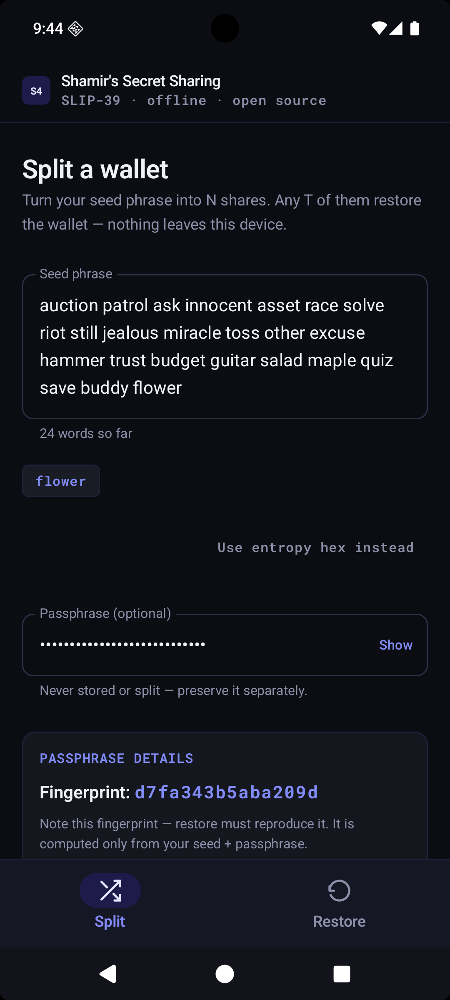 |

**PIN gate** — mandatory 6-digit, PBKDF2-HMAC-SHA256 120k + exponential 30s→24h lockout — setup, unlock, and Settings → Change PIN:

Light:

<p>
  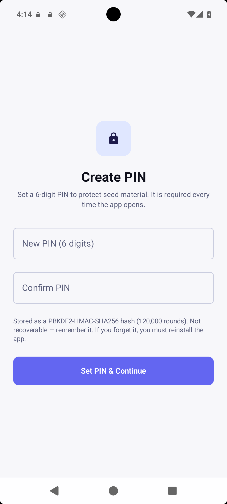
  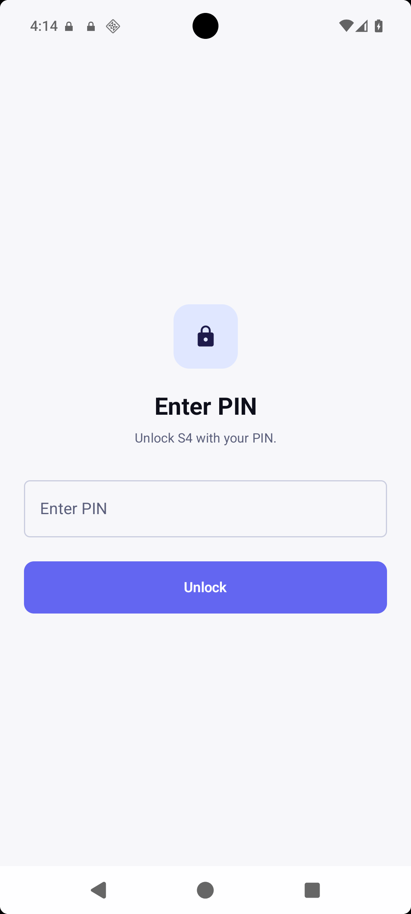
  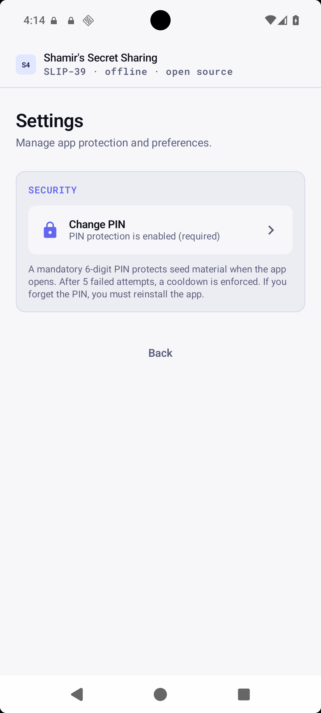
</p>

Dark:

<p>
  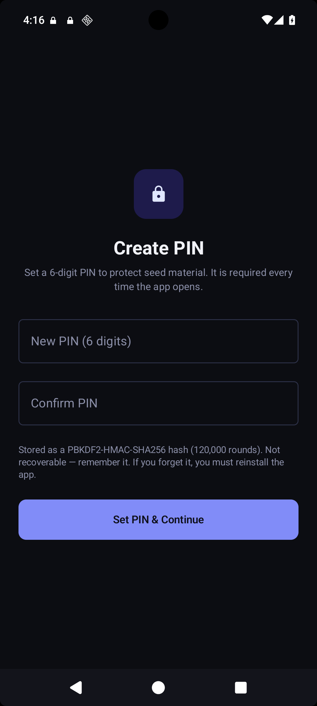
  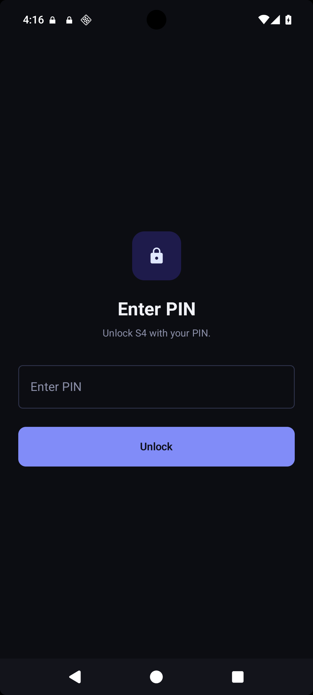
  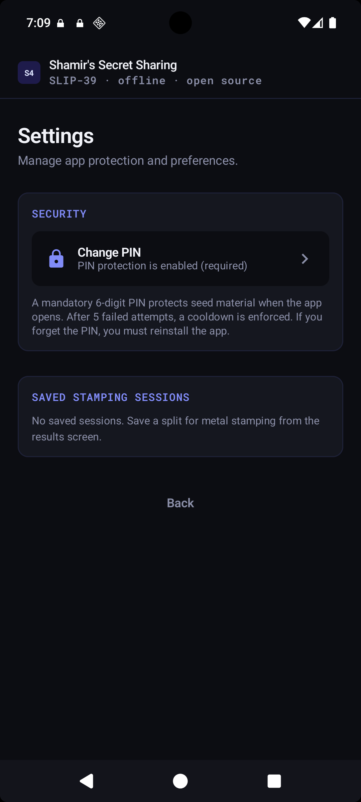
</p>

**Metal stamping** — the save PIN prompt, the saved code card on the results page, the "Done stamping" confirmation, the Resume dialog, and Settings → Saved stamping sessions:

Light:

<p>
  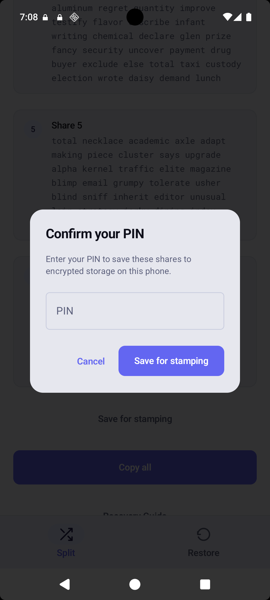
  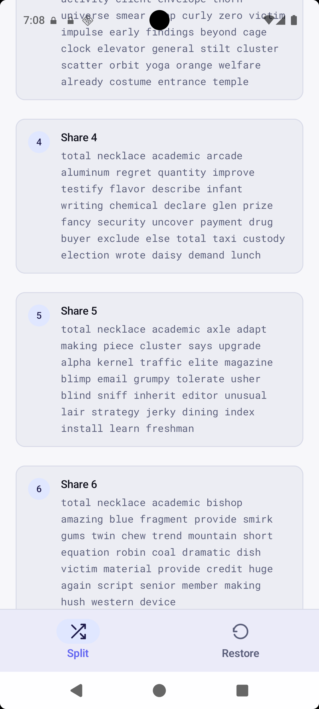
  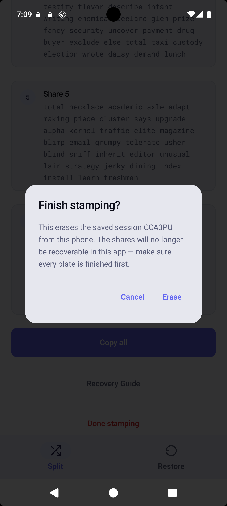
  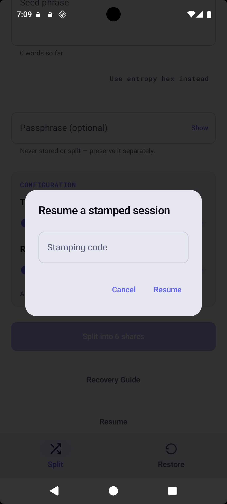
  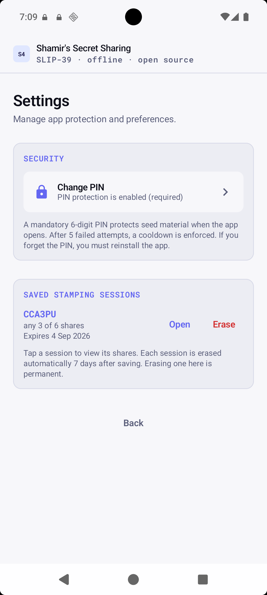
</p>

Dark:

<p>
  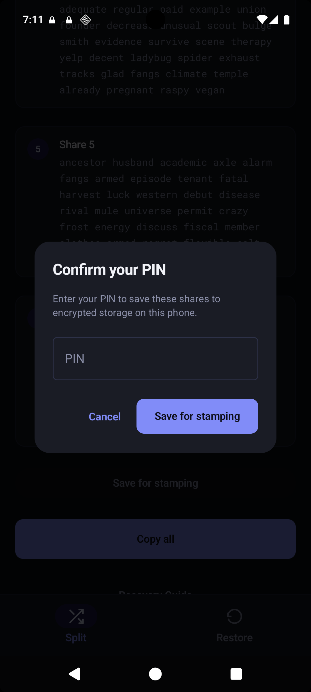
  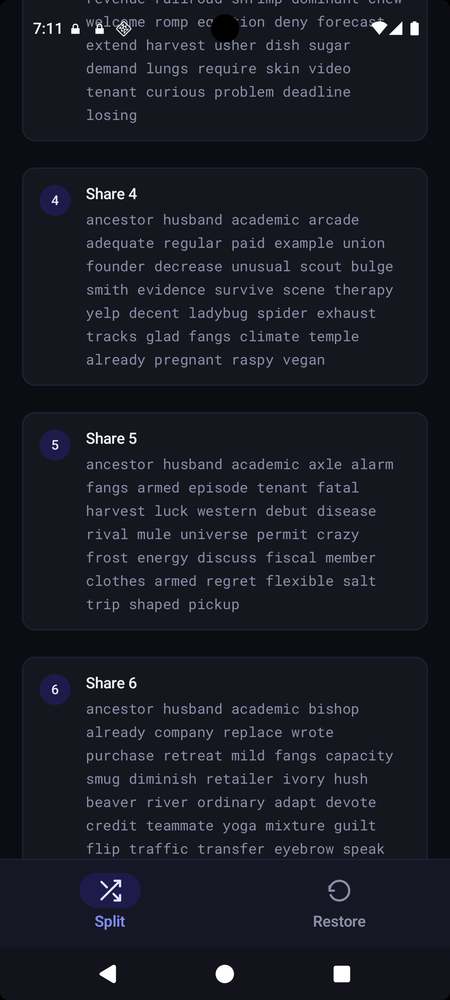
  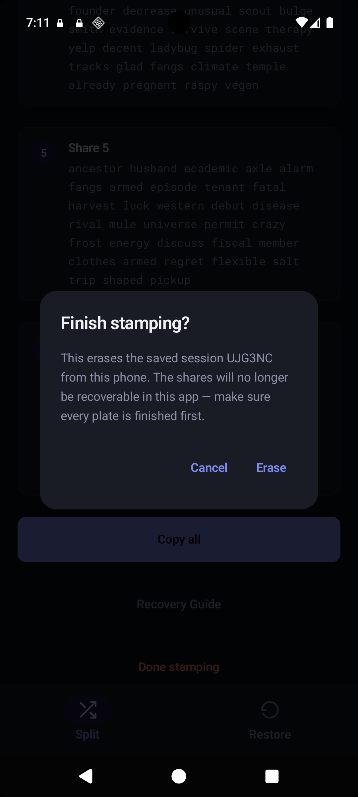
  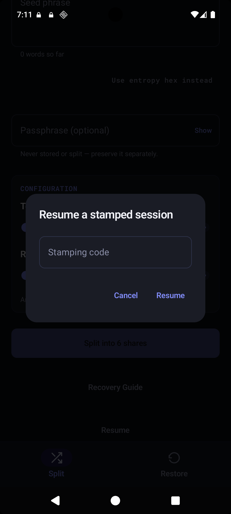
  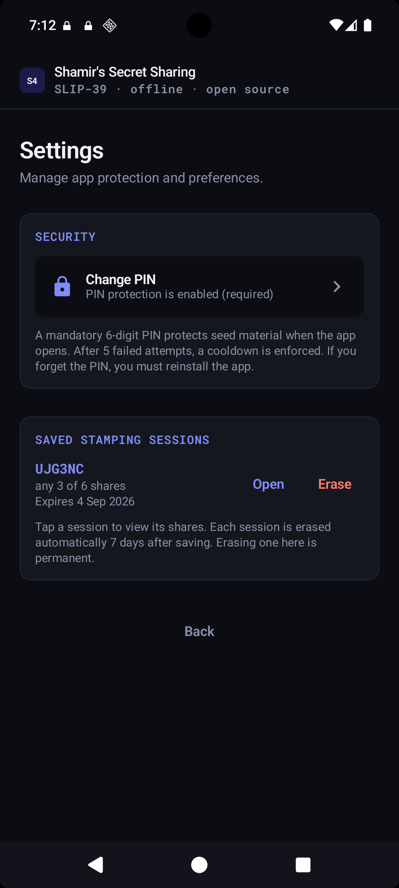
</p>

Regenerate them with `make screens` and `make screens-dark` (the app's FLAG_SECURE blocks `adb screencap`, so these use the emulator's own screenshot instead). A step-by-step, picture-by-picture walkthrough of every screen lives in `user-guide.md`.

## The setup

The phone is provisioned once by `airgap/airgap.sh`, run from a laptop over ADB. The script installs the apps listed in `airgap/apps.json` with SHA-256 checksum verification, sets **Dhizuku** as Device Owner, force-stops and disables or uninstalls bloatware (`airgap/packages.txt`, `airgap/uninstall.txt`), kills radios (Wi-Fi, Bluetooth, data, NFC) and enables airplane mode, and disables background scanning.

### After the script: configure the failsafe

1. Open the **Dhizuku** app, tap "Application Management", and check "Allow Dhizuku Access" for the **"Island - Mobile"** app — the stealth/fake name for **Android AntiForensic Tools**.
2. Open the "Island - Mobile" app (Android AntiForensic Tools). Uncheck "Auto Update" so it stops nagging for updates.
3. Tap "Activate the Accessibility services" → **Permission Settings** → check **Admin Rights**, **Dhizuku**, and **Accessibility Service** (this opens Android's Accessibility settings, where you allow "Island - Mobile" full control of the device).
4. Tap "Activate the Accessibility services" → **Data Destruction Settings** → check **Wipe Data**, **Hide App**, **Clear Itself**, and **Clear App Data**.
5. Tap "Activate the Accessibility services" → **Triggers Settings** → check **Duress Password**; for **Prevent Brute Force** choose **With Admin Rights**, and set **Wrong Attempts** to **3**.
6. Beyond these, you can configure any other options Android AntiForensic Tools provides.
7. Create a login password instead of a PIN, then configure AirGap Vault.

- **AirGap Vault** — open-source air-gapped wallet app (airgap.it). It holds the private key and secret recovery phrase on a dedicated offline phone, signs transactions via QR codes, and never connects to a network. Key generation mixes the hardware RNG with audio/video/touch/accelerometer entropy and supports physical dice and coin rolls.
- **Dhizuku** — open-source Device Owner broker (`com.rosan.dhizuku`). Android normally lets only one app hold Device Owner privileges; Dhizuku shares that privilege with other apps, which is what lets AFTools wipe the device.
- **Android AntiForensic Tools (AFTools)** — open-source anti-forensics app. It silently and irreversibly wipes the device when a **duress password** is entered on the lock screen, the wrong password is entered three times, a USB device is connected while locked, or the power button is pressed repeatedly. On Android 14+ the wipe requires Device Owner rights — hence Dhizuku. (The "USUAL" build ships under Island's package name, `com.oasisfeng.island`, for stealth.)

The result: if an adversary pressures the user to unlock the phone, or guesses the password wrong three times, the phone destroys itself. Nothing on it survives — by design. The seed's only survivors are the paper shares S4 produced, which is exactly why they must be hand-written and stored apart.

## How S4 fits in

1. Create the wallet in AirGap Vault on the offline phone. Entropy can come from the user's **physical dice rolls** — AirGap Vault's Coin Flip & Dice Roll, or raw entropy hex fed straight into S4.
2. Open S4 and split the seed into N shares with your chosen threshold (default **6 shares, any 3**). Write each share on paper and store them in different places.
3. Hand-copy the **Recovery Guide** and keep it with the shares. It names only frozen standards and long-lived tools (e.g. `iancoleman.io/slip39`, `iancoleman.io/bip39`, `python-mnemonic`, a Trezor device), so a beneficiary can rebuild the wallet in 2076 with no app and no domain knowledge.
4. If the phone is ever reset, destroyed, or lost, any T shares restore the exact seed — in this app or any surviving SLIP-39 tooling.

## What it does

- **Split** — enter a 12/15/18/21/24-word BIP-39 mnemonic (or raw entropy hex), pick total shares (2–16) and a restore threshold (1 ≤ T ≤ N, default **6 shares / T=3**), optionally add a BIP-39 passphrase, and get that many SLIP-39 share phrases (20–33 words each) on a full-screen results page.
- **Restore** — paste any T shares (one per line, with SLIP-39 word suggestions) and the app returns the exact original seed words plus a verification fingerprint, or a clear error (too few shares, wrong word, corrupted checksum, mismatched wallets).
- **Recovery Guide** — a short verbatim-copyable text the user hand-writes next to the shares so a stranger can reconstruct the wallet with any SLIP-39 + BIP-39 tooling, no app required.
- **Fingerprint verification** — a `SHA-256(seed)` prefix shown at both split and restore time, so a wrong word or wrong passphrase is caught before any funds are touched.
- **Metal stamping sessions (optional)** — on the results screen, "Save for stamping" persists the shares to Keystore-encrypted storage under a short paper-written code (PIN-gated), so they survive phone reboots and app kills across an hours-long stamping workflow. "Resume" on the Split screen (or Settings → Saved stamping sessions) brings them back with just the code + PIN; "Done stamping" wipes them. Each session self-expires after 7 days: the app never decrypts an expired session, sweeps it from disk on the next access, and a best-effort alarm removes the bytes near the deadline even if the app stays closed.
- **PIN gate** — mandatory app-level 6-digit PIN (PBKDF2-HMAC-SHA256 120k, encrypted with Android Keystore, 30s→24h exponential cooldown, monotonic-clock lockout). Required on first launch and via Settings → Change PIN; required before any seed material is shown. Forgot PIN → reinstall (offline, no recovery).

## How it works

The **256-bit BIP-39 entropy** (not the 512-byte PBKDF2 seed) is the secret that gets sharded. Recovery returns that entropy, which converts deterministically back to the exact original words (the BIP-39 checksum is recomputed, never stored) — the same round-trip SSKR performs. A 256-bit secret yields **33-word shares**; smaller secrets yield 20/23/27/30-word shares.

The crypto is vendored C — `bc-shamir`, `bc-slip39`, and a `bc-crypto-base` subset (SHA-2, HMAC, PBKDF2, memzero) — built with CMake + NDK and exposed to Kotlin through two thin JNI facades (`shamir_jni.cpp`, `slip39_jni.cpp`). No OpenSSL: SLIP-39's encryption is a Luby-Rackoff network keyed by PBKDF2-HMAC-SHA256. Randomness comes from Android `SecureRandom`, bridged into the C `random_generator` callback.

The app uses a single SLIP-39 group (`group_threshold = 1`, `[{threshold=T, count=N}]`), `iteration_exponent = 0`, and an empty SLIP-39 encryption passphrase. The **BIP-39 passphrase** ("25th word") is deliberately **never sharded** — it is a single secret the user preserves separately and the Recovery Guide documents. Sharding a low-entropy passphrase would let T−1 shareholders brute-force it offline; keeping it out of the shares removes that vector.

## Security model

- **Fully offline** — no `INTERNET` permission in the manifest; nothing is uploaded, sent, or logged anywhere.
- **Nothing persisted (except PIN + opt-in stamping sessions)** — seed material lives only in memory unless the user deliberately opts into a metal-stamping session. Secret input fields use plain `remember` (not `rememberSaveable`) so secrets never land in system saved-state bundles or on disk; `android:allowBackup="false"` disables cloud backups. The only persisted secret-adjacent data is the PIN's PBKDF2 verifier (never the PIN) and, after an explicit "Save for stamping", the shares themselves — AES-GCM-encrypted under the Android Keystore (same keys as the PIN verifier), gated by the PIN before they are ever shown again, and self-expiring after 7 days.
- **PIN protection** — 6-digit PIN, confirmed twice, stored as PBKDF2-HMAC-SHA256 120k + 16-byte salt, ciphertext `enc:iv:cipher:hmac` bound to the pref key via AAD and encrypted under Android Keystore (`S4MasterKey`/`S4HmacKey` with `KeystoreKeyRecovery`). Monotonic clock (`elapsedRealtime` + persisted anchor) enforces a 5-attempt 30s exponential backoff capped at 24h, surviving reboots and wall-clock rollback. `resolvePinGate`/`decideAuthPinSubmit` fail closed on `PinUnreadable` (never verifies against empty hash, never counts as failure). Change PIN requires current PIN; forgot PIN → reinstall.
- **Screens are protected** — `FLAG_SECURE` is set unconditionally, blocking screenshots, recents snapshots, and screen-mirroring capture.
- **Gated clipboard** — copying the full share set or a session-backed guide (which embeds the wallet's entropy) requires an explicit risk-confirmation dialog, because the clipboard is readable by other apps and persists after S4 closes.
- **Stable results** — the results page is a full screen that never auto-dismisses; shares are never regenerated while it is open, and the in-memory session is dropped when the user taps Done.
- **Threat model** — SLIP-39 provides computational (not information-theoretic) security: a holder of T−1 shares can brute-force via the checksum oracle (2⁻³² false positives), which is fine for 256-bit seed entropy. The app-level PIN adds a second layer when the Android lock screen is already unlocked (shoulder surfing, lending the phone).
- **Failsafe** — because the phone is configured to factory-reset on coercion (AFTools via Dhizuku), shares are paper-only by default. A stamping session is a deliberate, time-limited exception: the shares sit on the phone only while the owner is physically punching plates, are encrypted at rest, and expire after a week. Expiry is two-layered — the store's lazy expiry makes an expired session unreadable (and sweeps it) the moment the app next runs, which is the actual guarantee; an inexact alarm (`setAndAllowWhileIdle`, no special permission) plus a `BOOT_COMPLETED` receiver scrub the bytes from disk near the deadline even if the app stays closed. A factory reset still destroys both the prefs and the Keystore keys — nothing on-device survives a full wipe, by design.

## Tech stack

| Component | Version |
|---|---|
| Kotlin / Compose plugin | 2.4.10 |
| Compose BOM | 2026.06.01 (Compose 1.11.4) |
| Material 3 + Navigation Compose | BOM / 2.9.8 |
| AGP / Gradle | 9.3.1 / 9.7.0 |
| compileSdk / targetSdk / minSdk | 37 / 37 / 26 |
| NDK / CMake | 29.0.14206865 / 3.22+ |
| JNI facades | `shamir_jni` + `slip39_jni` (arm64-v8a, armeabi-v7a, x86_64) |
| Native crypto | vendored bc-shamir, bc-slip39, bc-crypto-base (pinned) |

## Project layout

```
s4/
├─ about.md                  # user manual — who it's for and how to use it
├─ LICENSE                   # GNU GPL v3.0 (only)
├─ CONTRIBUTING.md           # how to contribute and how to run the checks
├─ Makefile                  # build / test / install / screenshot helpers
├─ airgap/                   # one-shot phone provisioning (airgap.sh, apps.json, packages.txt)
├─ .github/workflows/ci.yml  # CI: unit + lint + build (macOS) and instrumented tests (emulator)
├─ tools/
│  ├─ start-emulator.sh      # boots the s4_dev AVD when no device is connected
│  └─ host-jni/build-host.sh # builds a macOS dylib so JVM tests run real native code
├─ app/
│  ├─ src/main/
│  │  ├─ java/com/s4/
│  │  │  ├─ MainActivity.kt          # PIN gate + nav graph, header bar, bottom Split/Restore nav
│  │  │  ├─ ui/                      # Split/Restore/Results/Guide + pin/ (AuthPinScreen, PinManagementScreen, PinGate)
│  │  │  ├─ data/crypto/             # PinManager, KeystoreManager, PrefsCrypto + Slip39/Shamir
│  │  │  ├─ data/repository/         # PinStore, PinRepository, SessionRepository, PinLockoutPolicy, MonotonicClock, ProtectedPrefsStore
│  │  │  ├─ data/session/            # stamping sessions: SessionStore, SessionCodec, SessionCodeGenerator, SessionExpiryAlarm + boot/expiry receivers
│  │  │  ├─ navigation/Routes.kt     # SPLIT/RESTORE/GUIDE/SETTINGS/PIN_MANAGE
│  │  │  ├─ crypto/                  # Slip39.kt, Shamir.kt, ShareCodec.kt, wordlists
│  │  │  ├─ bip39/Bip39.kt           # entropy ⇄ words, seed derivation, fingerprint
│  │  │  ├─ guide/RecoveryGuide.kt   # the verbatim Recovery Guide builder
│  │  │  └─ model/SplitParams.kt
│  │  ├─ cpp/                        # vendored C crypto + CMakeLists + JNI facades
│  │  └─ resources/                  # BIP-39 and SLIP-39 wordlists
│  ├─ src/test/                      # 190+ JVM unit tests (91 original + 60+ PIN suite + 40+ stamping-session suite, real native code)
│  └─ src/androidTest/               # 40+ instrumented tests (SplitRestoreFlow + PIN + on-device crypto + StampFlow)
├─ art/screens/guide/                # `make screens` output incl. pin-setup/unlock/settings (light+dark)
```

## Building and developing

Prerequisites: an Android SDK with platform 37 and NDK `29.0.14206865`, and a JDK (the Makefile defaults to Android Studio's bundled JBR on macOS). Then `make help` lists every target; the commonly used ones:

| Target | What it does |
|---|---|
| `make build` | assemble the debug APK |
| `make unit` | run the 91 JVM unit tests (real native code via the host dylib) |
| `make android-test` | run all instrumented tests (boots the emulator if needed) |
| `make ui-test` | run only the Compose UI flow tests |
| `make lint` | Android lint on the debug variant |
| `make install` / `make launch` | build + install / launch on a connected device |
| `make verify` | full gate: unit + instrumented + lint + build |
| `make screens` / `make screens-dark` | capture light / dark screenshots |
| `make emulator` / `make emulator-stop` | boot / kill the `s4_dev` AVD |

You can also call the wrapper directly, e.g. `./gradlew :app:assembleDebug` or `./gradlew :app:testDebugUnitTest`. Device-requiring targets prefer a physical phone and only boot the emulator when none is connected. The phone is hardened end-to-end by `airgap/airgap.sh`, which also installs S4 from its `airgap/apps.json` entry.

## Testing

- **190+ JVM unit tests, 0 failures** (verified): 91 original (BIP-39 round-trips/fingerprint, SLIP-39 generation/combine — 11 valid/30 invalid trezor vectors, Shamir, ShareCodec, Guide, WordCompletion, full word-count matrix) + 60+ PIN suite ported from Airgate's well-tested gap: `PinManagerTest` (PBKDF2 iterations/algorithm/salt, constant-time verify, short-PIN reject), `PinLockoutPolicyTest` (5→30s doubling to 24h cap, overflow guards), `PinStoreTest` (single-record vs legacy, refusal on empty/invalid, tamper flag, anti-downgrade), `MonotonicClockTest` (reboot survival, never-backwards), `PinGateTest`/`AuthPinSubmitDecisionTest` (NoPinConfigured/PinUnreadable/Verify branches) + 40+ stamping-session suite: `SessionCodecTest` (round-trips, field-count guard, bounds, fail-closed malformed records), `SessionCodeGeneratorTest` (unambiguous alphabet, uniqueness, request-code collision-freedom), `SessionStoreTest` (persist/reload, multi-session coexistence, delete keeps the registry protected, save rollback on failed registry write, 7-day lazy expiry + sweep, legacy plaintext-registry recovery, fail-closed corruption). Unit tests exercise the real C code through a host dylib (`tools/host-jni/build-host.sh`).
- **40+ instrumented tests**: end-to-end Compose flows (`SplitRestoreFlowTest` — split 24-word → copy → restore 3/5, passphrase fingerprint, errors, guide copy; PIN flows — setup/unlock/lockout, Settings → Change/Remove, tamper; `StampFlowInstrumentedTest` — save for stamping, resume by code + PIN, multiple sessions, done-stamping wipe, Settings list/open/erase) plus SLIP-39 and Shamir vector/round-trip tests on the device `.so`. `make screens` parks on every screen (incl. the stamping save/resume/settings screens) as well (`ScreenshotCaptureTest`).

## Documentation

- `about.md` — the user manual: who the app is for, what it solves, and how to use it in plain language.
- `user-guide.md` — a step-by-step, screenshot-driven walkthrough of every screen.
- `airgap/README.md` — how to prepare the laptop, the phone, and the provisioning script.

## License

S4 is free software released under the **GNU General Public License, version 3** (SPDX: `GPL-3.0-only`) — see `LICENSE`. You may run, study, modify, and redistribute it, provided any distributed copies or derivative works are offered to recipients under the same GPL-3.0 terms with their corresponding source.

The vendored native crypto under `app/src/main/cpp/` (bc-shamir, bc-slip39, bc-crypto-base) is independently licensed by Blockchain Commons under the **BSD-2-Clause-Patent** license (see the `LICENSE` file in each directory), which is compatible with GPL-3.0. The BIP-39 and SLIP-39 wordlists are data published by their respective specifications.
