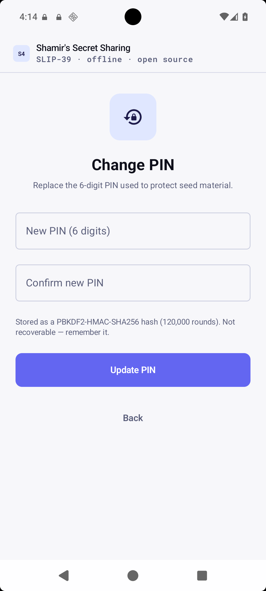

# S4 user guide — step by step

This is the picture-by-picture guide to using S4. It walks the same journey as the manual in `about.md`, with a screenshot of every screen. Everything happens on the phone, fully offline — nothing is uploaded, saved, or stored anywhere. The only things that ever persist are the mandatory 6-digit PIN (as a PBKDF2 verifier, never the PIN) and — only if you opt in — a stamping session you are punching into metal (§3a), which self-expires after 7 days.

## 0. PIN — first launch, then every launch

On first launch S4 prompts you to set a 6-digit PIN (confirmed twice) before any other screen is shown.

If a PIN is set, every subsequent launch shows the PIN entry screen before any other screen. On success the app unlocks to where you left off. On failure the app tells you the PIN is wrong; after 5 failures a cooldown is enforced (30s, then 60s, 120s… doubling to a 24h cap). The cooldown survives reboots and wall-clock rollback (monotonic clock), and the phone's own lock screen remains the outer brute-force gate (out of scope for this cooldown).

**If you forget the PIN:** there is no recovery — the app is offline with no account. You must reinstall the app (the shares on paper are unaffected). This is the same gap as Airgate's `AuthPinScreen`/`PinStore` (well-tested, Keystore-backed).

Manage the PIN from **Settings** (gear icon in the header) → **Change PIN**:

- **Change PIN** — requires current PIN (verified via `PinVerifyDialog`), then enter the new 6-digit PIN twice. The old verifier is replaced atomically (`v1:salt:iter:algo:hash`).

Dark variants of every PIN screen are captured by `make screens-dark`: `pin-setup-dark.png`, `pin-unlock-dark.png`, `settings-dark.png`, `pin-manage-dark.png`.

## 1. Split your seed phrase into shares

1. Open S4 (enter PIN). The split screen appears.
2. Type your seed phrase (the 12, 18, or 24 words your wallet shows you) into the field. Word suggestions appear as you type.
3. If your wallet uses a passphrase (a "25th word"), enter it too. The app shows a fingerprint preview so you can confirm the passphrase before splitting.
4. Pick how many shares you want (2–16) and how many must be brought together to rebuild the wallet. The default is a sensible starting point: **6 shares, any 3 needed**.
5. Tap **Split into N shares**.

The header's gear opens Settings (PIN) at any time.

## 2. Or use raw entropy hex instead

If you created your wallet with physical dice, you may have raw entropy hex rather than words. Tap **Use entropy hex instead** and paste it — it produces the same shares.

## 3. The results page — your shares

S4 shows every share as its own block of English words. The fingerprint at the top is a short check code for your wallet.

- **Write each share down on paper and store it separately.** No single place should hold enough shares to rebuild the wallet.
- S4 never stores the shares itself — close the screen and they are gone, unless you opted into a stamping session (§3a).

## 3a. Stamping the shares into metal (optional)

If you are punching the shares onto metal plates, the job takes hours and spans days. Instead of re-entering everything if the phone dies mid-job, save the session on the results page:

1. Tap **Save for stamping** and confirm your PIN.
2. S4 writes the shares to encrypted storage and shows a short **code** (six characters like `X7K2M9`) for your reference. Write it down on a paper.

3. Next session — later the same day, or a week later — tap **Resume** on the Split screen, type the code, and confirm your PIN. Your shares come back exactly where you left them.

4. Finished every plate? Open the session and tap **Done stamping**, then confirm. The saved copy is erased from the phone.

Saved sessions are also listed in **Settings → Saved stamping sessions**, where you can open one (to view its shares) or erase it (to wipe the copy) — handy if you lose the paper code.

**Important:** every saved session self-destructs **7 days after saving** — the app never shows an expired session and a background alarm scrubs the file even if you never open the app again. Plan to finish each job within a week. This copy is a temporary working aid for the punch job, not a backup: the paper shares remain the wallet's real master copy.

## 4. The Recovery Guide

Tap **Recovery Guide** to see a short, plain-language note you hand-write next to your shares. It tells whoever finds them — years later, with no app and no crypto knowledge — exactly how to rebuild the wallet.

Right after a split the guide is already filled in with your exact settings. Opened on its own, it shows a blank template you fill in by hand.

## 5. Restore a wallet

1. Switch to the **Restore** tab.
2. Paste any T shares, one per line (word suggestions appear as you type).
3. If the wallet used a passphrase, enter it too.
4. Tap **Restore wallet**.

## 6. A successful restore

S4 returns your exact original seed words plus the fingerprint. Check it matches the one you noted at split time — that is how you know every share and the passphrase are correct.

## 7. If something is wrong

Entering too few shares (or a wrong or corrupted word) shows a clear error instead of a wrong result. The wallet is never rebuilt from incomplete or bad shares.

## 8. Security notes

- S4 never touches the network. Seed material lives in memory and is dropped when you leave the screen or the app closes — except for an opted-in stamping session, which is stored Keystore-encrypted, PIN-gated, and self-expires after 7 days (lazy expiry makes it unreadable; a background alarm + boot receiver scrub the bytes). Secrets use plain `remember` (not `rememberSaveable`) and `android:allowBackup="false"`.
- **PIN:** 6 digits, PBKDF2-HMAC-SHA256 120k + Keystore-encrypted `enc:iv:cipher:hmac` (AAD-bound, `KeystoreKeyRecovery`), 5-attempt 30s→24h monotonic lockout, fail-closed `PinUnreadable`. Inspired by Airgate's well-tested gap.
- Copying shares (or a guide that embeds the wallet) to the clipboard requires an explicit confirmation first, because the clipboard is readable by other apps.
- `FLAG_SECURE` blocks screenshots/recents. PIN screens themselves are also `FLAG_SECURE`.

Dark variants of every screen are captured by `make screens-dark` (`…-dark.png` alongside each light capture, including `save-pin`, `results-saved`, `done-stamping`, `resume`, `settings-sessions`).
