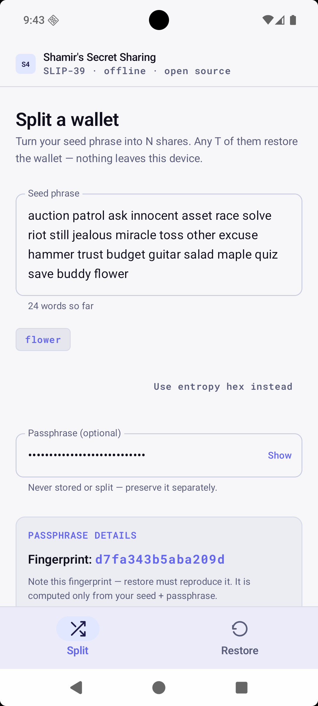
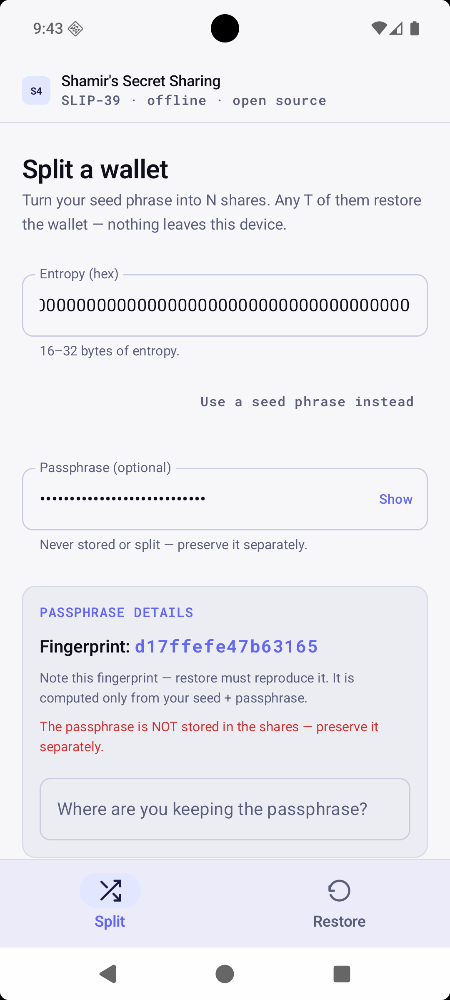
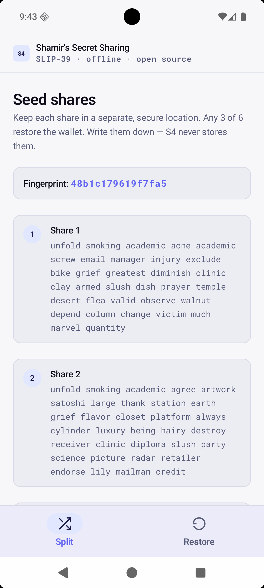
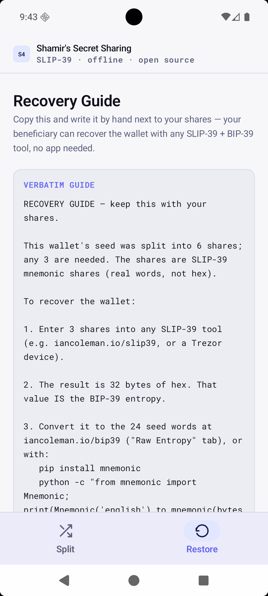
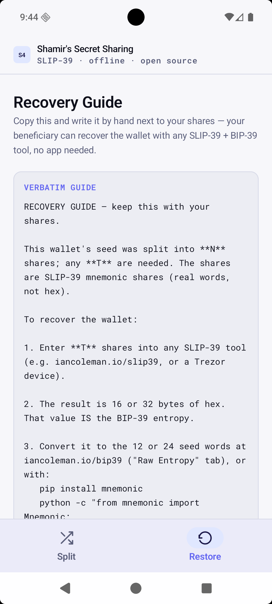
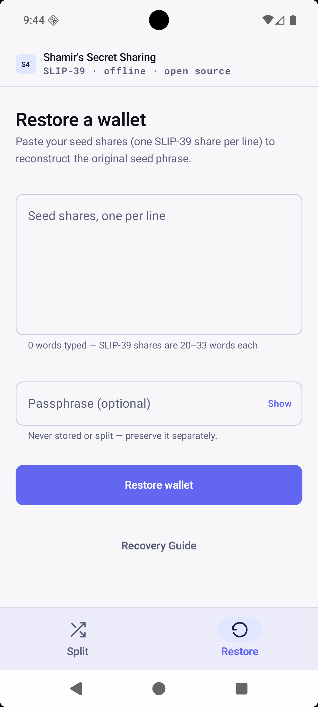
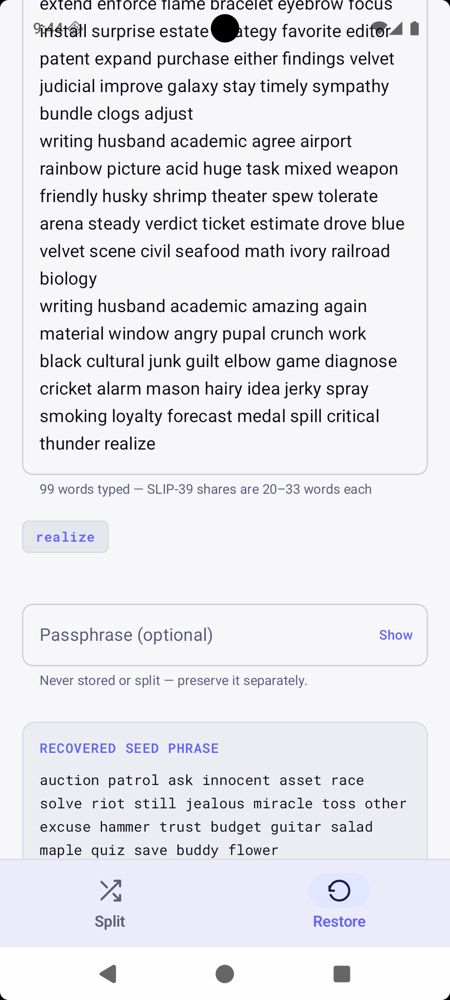
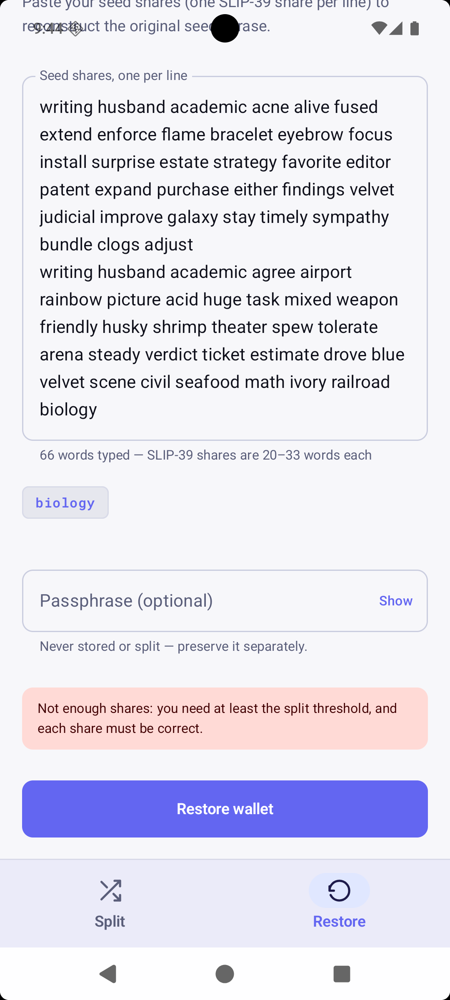

# S4 user guide — step by step

This is the picture-by-picture guide to using S4. It walks the same journey as the manual in `about.md`, with a screenshot of every screen. Everything happens on the phone, fully offline — nothing is uploaded, saved, or stored anywhere.

## 1. Split your seed phrase into shares

1. Open S4. The split screen appears first.
2. Type your seed phrase (the 12, 18, or 24 words your wallet shows you) into the field. Word suggestions appear as you type.
3. If your wallet uses a passphrase (a "25th word"), enter it too. The app shows a fingerprint preview so you can confirm the passphrase before splitting.
4. Pick how many shares you want (2–16) and how many must be brought together to rebuild the wallet. The default is a sensible starting point: **6 shares, any 3 needed**.
5. Tap **Split into N shares**.

## 2. Or use raw entropy hex instead

If you created your wallet with physical dice, you may have raw entropy hex rather than words. Tap **Use entropy hex instead** and paste it — it produces the same shares.

## 3. The results page — your shares

S4 shows every share as its own block of English words. The fingerprint at the top is a short check code for your wallet.

- **Write each share down on paper and store it separately.** No single place should hold enough shares to rebuild the wallet.
- S4 never stores the shares itself — close the screen and they are gone.

## 4. The Recovery Guide

Tap **Recovery Guide** to see a short, plain-language note you hand-write next to your shares. It tells whoever finds them — years later, with no app and no crypto knowledge — exactly how to rebuild the wallet.

Right after a split the guide is already filled in with your exact settings. Opened on its own, it shows a blank template you fill in by hand.

## 5. Restore a wallet

1. Switch to the **Restore** tab.
2. Paste any T shares, one per line (word suggestions appear as you type).
3. If the wallet used a passphrase, enter it too.
4. Tap **Restore wallet**.

## 6. A successful restore

S4 returns your exact original seed words plus the fingerprint. Check it matches the one you noted at split time — that is how you know every share and the passphrase are correct.

## 7. If something is wrong

Entering too few shares (or a wrong or corrupted word) shows a clear error instead of a wrong result. The wallet is never rebuilt from incomplete or bad shares.

## Security notes

- S4 never touches the network and stores nothing — all state lives in memory and is dropped when you leave the screen.
- Copying shares (or a guide that embeds the wallet) to the clipboard requires an explicit confirmation first, because the clipboard is readable by other apps.
